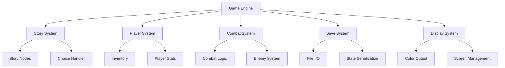

Introduction

This feature involves creating an interactive text-based adventure game in Python that provides an engaging, expressive, and fun gaming experience. The game will feature multiple storylines, player choices that affect outcomes, inventory management, and a simple combat system. The goal is to create something that's both entertaining and demonstrates interactive programming concepts.

## Requirements

### Requirement 1

**User Story:** As a player, I want to navigate through an interactive story with meaningful choices, so that I can experience different outcomes based on my decisions.

#### Acceptance Criteria

1. WHEN the game starts THEN the system SHALL display a welcome message and story introduction
2. WHEN a player is presented with choices THEN the system SHALL display numbered options for selection
3. WHEN a player selects a valid choice THEN the system SHALL progress the story based on that choice
4. WHEN a player selects an invalid choice THEN the system SHALL display an error message and re-prompt for input
5. IF a player reaches a story branch THEN the system SHALL remember previous choices to influence future outcomes

### Requirement 2

**User Story:** As a player, I want to manage an inventory of items I collect during the adventure, so that I can use them to solve puzzles or overcome challenges.

#### Acceptance Criteria

1. WHEN a player finds an item THEN the system SHALL add it to their inventory
2. WHEN a player checks their inventory THEN the system SHALL display all collected items with descriptions
3. WHEN a player uses an item THEN the system SHALL remove it from inventory and apply its effect
4. IF a player's inventory is full THEN the system SHALL notify them and require item management
5. WHEN an item is required for a puzzle THEN the system SHALL check if the player has it in inventory

### Requirement 3

**User Story:** As a player, I want to engage in simple combat encounters, so that I can experience challenge and strategy in the game.

#### Acceptance Criteria

1. WHEN a combat encounter begins THEN the system SHALL display player and enemy health
2. WHEN it's the player's turn THEN the system SHALL offer attack, defend, or use item options
3. WHEN a player attacks THEN the system SHALL calculate damage and update enemy health
4. WHEN an enemy attacks THEN the system SHALL calculate damage and update player health
5. IF player health reaches zero THEN the system SHALL trigger a game over scenario
6. IF enemy health reaches zero THEN the system SHALL grant victory and possible rewards

### Requirement 4

**User Story:** As a player, I want to save and load my game progress, so that I can continue my adventure across multiple sessions.

#### Acceptance Criteria

1. WHEN a player chooses to save THEN the system SHALL store current game state to a file
2. WHEN a player starts the game THEN the system SHALL offer options to start new or load existing game
3. WHEN a player loads a saved game THEN the system SHALL restore all progress, inventory, and story position
4. IF no save file exists THEN the system SHALL start a new game automatically
5. WHEN saving fails THEN the system SHALL display an error message and continue without saving

### Requirement 5

**User Story:** As a player, I want colorful and engaging text output, so that the game feels visually appealing and immersive.

#### Acceptance Criteria

1. WHEN text is displayed THEN the system SHALL use colors to differentiate story text, choices, and system messages
2. WHEN important events occur THEN the system SHALL use special formatting or colors for emphasis
3. WHEN displaying health or stats THEN the system SHALL use color coding (green for good, red for danger)
4. IF the terminal doesn't support colors THEN the system SHALL gracefully fall back to plain text
5. WHEN clearing the screen THEN the system SHALL provide a clean interface for better readability
Overview

The Interactive Adventure Game is a text-based Python application that provides an engaging gaming experience through storytelling, player choices, inventory management, combat, and save/load functionality. The game uses object-oriented design principles with a modular architecture that separates concerns for maintainability and extensibility.

## Architecture

The game follows a Model-View-Controller (MVC) pattern with the following high-level components:

- **Game Engine**: Core game loop and state management
- **Story System**: Manages narrative flow and branching storylines
- **Player System**: Handles player state, inventory, and statistics
- **Combat System**: Manages turn-based combat encounters
- **Save System**: Handles game state persistence
- **Display System**: Manages colored text output and user interface



## Components and Interfaces

### Game Engine
- **Purpose**: Central coordinator that manages game flow and state transitions
- **Key Methods**:
  - `start_game()`: Initialize and begin game loop
  - `main_loop()`: Handle user input and game progression
  - `process_choice(choice)`: Route player choices to appropriate handlers
  - `check_game_over()`: Determine if game should end

### Story System
- **Purpose**: Manages narrative content and story progression
- **Key Classes**:
  - `StoryNode`: Represents a single story beat with text and choices
  - `StoryManager`: Handles story flow and branching logic
- **Key Methods**:
  - `get_current_story()`: Return current story content
  - `get_choices()`: Return available player choices
  - `advance_story(choice_id)`: Progress to next story node

### Player System
- **Purpose**: Manages player state, statistics, and inventory
- **Key Classes**:
  - `Player`: Core player object with health, inventory, and progress
  - `Inventory`: Container for items with capacity management
  - `Item`: Represents collectible/usable items
- **Key Methods**:
  - `add_item(item)`: Add item to inventory
  - `use_item(item_name)`: Use item and apply effects
  - `take_damage(amount)`: Reduce player health
  - `heal(amount)`: Restore player health

### Combat System
- **Purpose**: Handles turn-based combat encounters
- **Key Classes**:
  - `CombatManager`: Orchestrates combat flow
  - `Enemy`: Represents combat opponents
- **Key Methods**:
  - `start_combat(enemy)`: Initialize combat encounter
  - `player_turn()`: Handle player combat actions
  - `enemy_turn()`: Process enemy actions
  - `calculate_damage(attacker, defender)`: Determine damage values

### Save System
- **Purpose**: Manages game state persistence
- **Key Methods**:
  - `save_game(player, story_state)`: Serialize and save game state
  - `load_game()`: Deserialize and restore game state
  - `has_save_file()`: Check if save file exists

### Display System
- **Purpose**: Manages text output, colors, and user interface
- **Key Methods**:
  - `print_colored(text, color)`: Output colored text
  - `clear_screen()`: Clear terminal display
  - `display_health_bar(current, max)`: Show health visualization
  - `display_inventory(items)`: Format and show inventory

## Data Models

### Player Data Model
```python
{
    "name": str,
    "health": int,
    "max_health": int,
    "inventory": [Item],
    "story_position": str,
    "choices_made": [str],
    "experience": int
}
```

### Story Node Data Model
```python
{
    "id": str,
    "title": str,
    "description": str,
    "choices": [Choice],
    "items_found": [Item],
    "enemy_encounter": Enemy,
    "requirements": [str]
}
```

### Item Data Model
```python
{
    "name": str,
    "description": str,
    "type": str,  # "consumable", "key", "weapon"
    "effect": dict,  # {"heal": 20} or {"damage": 5}
    "usable": bool
}
```

### Save File Data Model
```python
{
    "player": Player,
    "current_story_id": str,
    "game_flags": dict,
    "timestamp": str
}
```

## Error Handling

### Input Validation
- Validate all user input for type and range
- Provide clear error messages for invalid choices
- Implement retry mechanisms for recoverable errors

### File Operations
- Handle file not found errors gracefully
- Provide fallback behavior when save/load fails
- Validate save file integrity before loading

### Game State Errors
- Detect and handle corrupted game states
- Provide recovery options when possible
- Log errors for debugging purposes

### Terminal Compatibility
- Detect color support and fall back to plain text
- Handle different terminal sizes gracefully
- Provide alternative display methods for accessibility

## Testing Strategy

### Unit Testing
- Test individual components in isolation
- Mock dependencies for focused testing
- Validate edge cases and error conditions

### Integration Testing
- Test component interactions
- Validate save/load functionality
- Test complete game flow scenarios

### User Experience Testing
- Test different story paths and choices
- Validate combat balance and difficulty
- Ensure color output works across terminals

### Performance Testing
- Measure game startup time
- Test with large save files
- Validate memory usage during extended play

The design emphasizes modularity, allowing for easy extension of story content, new item types, and additional game mechanics while maintaining clean separation of concerns.
Implementation Plan

- [ ] 1. Set up project structure and core data models
  - Create main game directory structure with separate modules
  - Implement Item, Player, and Enemy data classes with validation
  - Create base interfaces and abstract classes for extensibility
  - _Requirements: 1.1, 2.1, 3.1_

- [ ] 2. Implement display system with color support
  - Create DisplayManager class with color output methods
  - Implement terminal color detection and fallback mechanisms
  - Add methods for formatted health bars and inventory display
  - Write unit tests for display formatting and color handling
  - _Requirements: 5.1, 5.2, 5.3, 5.4_

- [ ] 3. Create inventory management system
  - Implement Inventory class with capacity management
  - Add methods for adding, removing, and using items
  - Create item effect system for consumables and tools
  - Write unit tests for inventory operations and edge cases
  - _Requirements: 2.1, 2.2, 2.3, 2.4_

- [ ] 4. Build story system foundation
  - Create StoryNode class to represent story segments
  - Implement StoryManager for story flow and branching logic
  - Add choice validation and story progression methods
  - Create sample story content for testing
  - Write unit tests for story navigation and choice handling
  - _Requirements: 1.1, 1.2, 1.3, 1.4, 1.5_

- [ ] 5. Implement combat system
  - Create CombatManager class for turn-based combat
  - Implement damage calculation and health management
  - Add combat actions (attack, defend, use item) with validation
  - Create Enemy class with AI behavior patterns
  - Write unit tests for combat mechanics and edge cases
  - _Requirements: 3.1, 3.2, 3.3, 3.4, 3.5, 3.6_

- [ ] 6. Create save and load functionality
  - Implement SaveManager class with JSON serialization
  - Add methods for saving and loading complete game state
  - Create save file validation and error handling
  - Add backup and recovery mechanisms for corrupted saves
  - Write unit tests for save/load operations and error scenarios
  - _Requirements: 4.1, 4.2, 4.3, 4.4, 4.5_

- [ ] 7. Build main game engine and loop
  - Create GameEngine class to coordinate all systems
  - Implement main game loop with input handling
  - Add game state management and transition logic
  - Integrate all systems (story, combat, inventory, save/load)
  - Write integration tests for complete game flow
  - _Requirements: 1.1, 1.2, 1.3, 1.4_

- [ ] 8. Create comprehensive story content
  - Write engaging story nodes with multiple branching paths
  - Add items, enemies, and puzzles throughout the adventure
  - Implement story requirements and conditional content
  - Balance combat encounters and item distribution
  - Test all story paths for completeness and consistency
  - _Requirements: 1.5, 2.5, 3.1_

- [ ] 9. Add screen management and user interface polish
  - Implement screen clearing and layout management
  - Add welcome screen, game over screen, and menus
  - Create help system and command reference
  - Add input validation with helpful error messages
  - Write tests for UI components and user interactions
  - _Requirements: 5.5, 1.4, 4.2_

- [ ] 10. Create main application entry point
  - Write main.py with command-line interface
  - Add game initialization and startup sequence
  - Implement new game vs load game selection
  - Add graceful shutdown and cleanup procedures
  - Create comprehensive end-to-end tests
  - _Requirements: 4.2, 4.4, 1.1_
